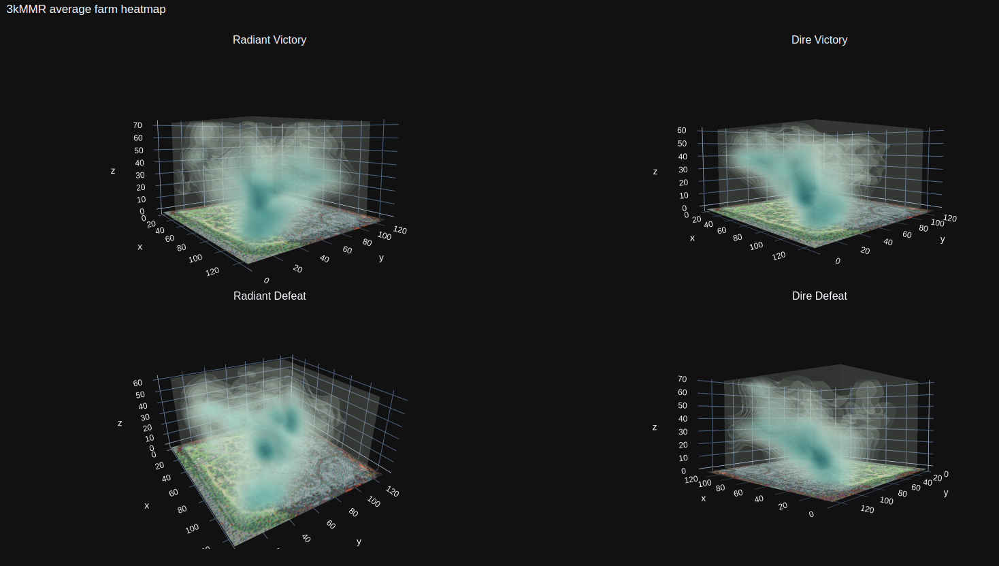

# Doten
Better Dota Analytics — now as a desktop app.



## What this is

I like Dota 2, I like graphs. Doten turns replays into **space-time visualizations**:
the minimap is the ground plane, time rises along the vertical axis, and everything
that happened in the game — movement, kills, deaths, farm, wards, runes, smokes,
objectives — lives somewhere in that column.

**Doten 2.0** (in [`app/`](app/)) is a [Tauri](https://tauri.app) desktop app that replaces
the old Python/plotly pipeline:

- **Drop a raw `.dem` replay** straight from the Dota client — no Java, no odota
  parser server. Replays are parsed natively in Rust (via
  [source2-demo](https://github.com/Rupas1k/source2-demo)) in under a second per game.
- **Timeline playback**: a scan plane sweeps up through the time column while hero
  icons move across the minimap. Scrub, play at 10–300×, step with arrow keys.
- **Event icons** pop onto the scan plane as it passes them: kills (with
  killer→victim lines), deaths, wards placed/killed, runes, smokes, towers,
  barracks, Roshan, aegis, buybacks, item purchases — all toggleable.
- **Activity cloud**: superimpose any event types for the whole game as a translucent
  density cloud in the column (the classic Doten look, but live).
- **Library aggregates**: every parsed game is stored; build clouds across your
  library filtered by team, victory/defeat, and a freeform tag (e.g. `3k` vs `7k`),
  just like the original MMR-bucket heatmaps.
- **Economy overlay**: net-worth advantage graph synced to the scan time; click it
  to scrub. Per-player net worth bars update live.

## Running the app

Prereqs: Rust, Node 20+, pnpm, and the [Tauri prerequisites](https://tauri.app/start/prerequisites/) for your OS.

```sh
cd app
pnpm install
pnpm tauri dev      # development
pnpm tauri build    # release bundle
```

Then drop a `.dem` file into the window (or use *Open replay*). Replays live in
`Steam/steamapps/common/dota 2 beta/game/dota/replays` — turn on
"automatically save my replays" in the Dota settings, or download one from any
match page on OpenDota/Dotabuff.

### CLI parsing harness

For poking at the extractor without the UI:

```sh
cd app/src-tauri
cargo run --release --example parse_cli -- /path/to/replay.dem
```

## Legacy version

The original Python/plotly version (odota JSONL → pandas → 3D KDE heatmaps)
still lives in the repo root: `parser.py`, `hero.py`. See git history for its
README. The `*.html` files are sample outputs.

### Patch-aware minimaps

The app detects the patch a replay was recorded on (via the Dota client version
embedded in the demo header) and loads the matching minimap: 7.38, 7.39, 7.40+,
or the legacy 7.31 image for anything older. Per-map world-coordinate bounds
have calibrated defaults and can be fine-tuned live in the **Map calibration**
panel (persisted per map version). Add future maps in `app/src/lib/coords.ts`
(`MAP_VERSIONS`) + `app/public/minimaps/`.

## Multiplayer (Gruve)

Doten is mesh-ready via [Gruve](gruve-kit/README.md): the Rust backend serves the
built frontend + a read-only API on port 9171 (`DOTEN_PORT` to change) and
announces itself to the local gruve agent. Friends on your mesh see a **Doten**
tile in their lobby and browse your replay library; everyone viewing **Together**
shares one session — same match, same scan-plane moment, play/pause/scrub/speed
all sync (plus gruve's built-in cursors).

- Host: run the Doten app (it announces automatically when an agent is running),
  and click **🌐 Shared view** in the top bar to join the shared session yourself —
  the native window is the control room (parse/tag/delete), the served view is
  the shared one.
- Viewers are read-only: parsing and library edits stay host-side by design.
- Validate after frontend changes: `pnpm build && ./gruve-kit/gruve doctor app/dist`.
- The kit (docs + agent binary) lives in `gruve-kit/`; the SDKs are vendored at
  `app/vendor/gruve-sdk` (JS) and `app/src-tauri/vendor/gruve-sdk-rs` (Rust).

## TODO

- True volumetric (raymarched) density rendering for the cloud.
- Four-pane victory/defeat × radiant/dire comparison view.
- Lane-phase detection, hero filters for aggregates ("show me my Slark games").
